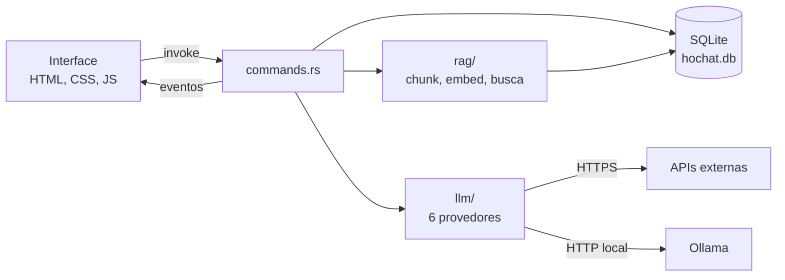
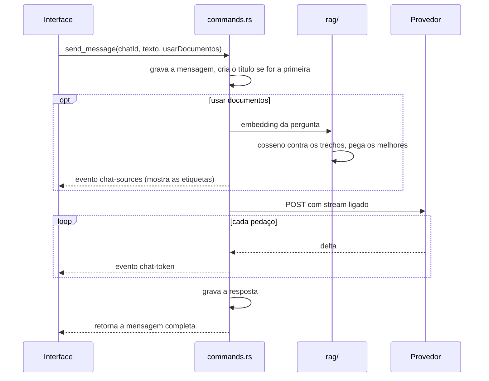

# Arquitetura

## A ideia geral

Duas metades. O Rust faz tudo que envolve segredo, rede e disco. O JavaScript só desenha e escuta
eventos. Elas conversam por dois canais: `invoke` (a tela pede algo e espera a resposta) e eventos
(o Rust avisa a tela sem ela ter pedido, que é como o streaming funciona).



Chave de API nunca cruza essa fronteira no sentido Rust → JavaScript. O front recebe
`hasKey: true` e uma máscara para mostrar na tela, nada além disso.

## Pastas

```
HoChat/
  index.html              a tela inteira, em HTML estático
  src/                    o front
    main.js               liga tudo, tema, atalhos, barra lateral
    api.js                cada comando do Rust vira uma função
    views.js              qual tela está aberta e o que vai na barra de título
    chat.js               lista de conversas, mensagens, streaming
    docs.js               base de conhecimento, upload, drag and drop
    settings.js           provedores, chaves, modelos, preferências
    dropdown.js           o único componente de seleção do app
    markdown.js           markdown mínimo, escapando o HTML
    ui.js                 toast, ícones, tema, formatação
    styles/               base, layout, chat, forms, dropdown
    assets/               logo e a fonte de ícones
  src-tauri/
    src/
      lib.rs              monta o app, registra os comandos
      commands.rs         tudo que o front pode chamar
      db.rs               conexão, migrações e as queries
      settings.rs         provedores, chaves, defaults
      llm/                um arquivo por formato de API
      rag/                chunk, embed, search, ingest
    migrations/           SQL numerado
  docs/
```

## Banco

Um SQLite só, em WAL, com `foreign_keys` ligado. As migrações ficam em `src-tauri/migrations/`,
numeradas, e são aplicadas comparando com o `PRAGMA user_version`. Para mudar o schema, é só
adicionar um arquivo novo e incluir no array do topo de `db.rs`:

```rust
const MIGRATIONS: &[&str] = &[include_str!("../migrations/001_inicial.sql")];
```

| Tabela | Guarda |
| --- | --- |
| `settings` | chave e valor em texto. É onde ficam API keys, URLs e preferências |
| `chats` | título e datas |
| `messages` | papel, conteúdo, e um JSON com os documentos que foram usados |
| `documents` | nome do arquivo, tamanho, e qual modelo de embedding indexou |
| `chunks` | o trecho, o vetor em BLOB e a etiqueta do modelo |

O vetor vira BLOB com `f32` em little-endian, quatro bytes por número. Ler e escrever é
`embedding_to_blob` e `blob_to_embedding`, em `db.rs`.

Guardar o nome do modelo junto com cada trecho resolve um problema chato: se eu trocar de
`nomic-embed-text` para `text-embedding-3-small`, os vetores antigos têm outra dimensão e não podem
ser comparados. A busca filtra por `model`, então os antigos simplesmente somem da consulta até eu
reindexar.

## Comandos

| Comando | Assunto |
| --- | --- |
| `list_chats`, `create_chat`, `rename_chat`, `delete_chat`, `clear_all_chats` | conversas |
| `list_messages`, `send_message`, `stop_generation` | mensagens |
| `get_settings`, `save_settings` | configurações |
| `list_models`, `check_provider` | descobrir modelos e testar a chave |
| `rag_status`, `list_documents`, `ingest_file`, `delete_document` | base de conhecimento |
| `storage_info`, `open_data_folder` | onde os dados moram e quanto ocupam |

`save_settings` recebe um patch: só os campos presentes são gravados. Mandar string vazia numa
chave de API apaga ela.

## As configurações

Tudo mora na tabela `settings`, como texto. As que têm um valor por provedor usam o id como sufixo:
`api_key.openai`, `model.claude`, `base_url.ollama`, `embed_model.gemini`.

| Chave | Padrão | Para quê |
| --- | --- | --- |
| `provider` | `ollama` | quem responde |
| `system_prompt` | instrução em português | vai no topo de toda conversa |
| `temperature` | `0.7` | previsível ou criativo |
| `top_p` | `1.0` | corta a cauda de palavras improváveis |
| `max_tokens` | `4096` | teto da resposta |
| `history_limit` | `20` | quantas mensagens passadas são reenviadas |
| `rag_top_k` | `4` | trechos por pergunta |
| `rag_min_score` | `0.15` | nota mínima do cosseno |
| `chunk_size` | `2000` | caracteres por trecho |
| `chunk_overlap` | `200` | repetição entre trechos vizinhos |
| `embed_provider` | `ollama` | quem gera os vetores |
| `theme` | `system` | claro, escuro ou o do sistema |
| `send_on_enter` | `true` | Enter envia ou quebra linha |

O `history_limit` existe porque toda mensagem antiga reenviada custa token em toda pergunta nova.
Ao cortar, o app garante que a janela começa numa mensagem do usuário — Claude recusa histórico que
comece com o assistente.

## O caminho de uma mensagem



Alguns detalhes que valem registrar:

**O título sai da primeira pergunta.** Enquanto a conversa se chama "Nova conversa", a primeira
mensagem vira título, cortada em 42 caracteres na última palavra inteira.

**Parar é uma flag, não um kill.** Cada conversa em andamento tem um `AtomicBool` num `HashMap`.
O `stop_generation` levanta a flag, o loop de leitura vê no próximo pedaço e sai limpo. O que já
chegou é gravado como resposta normal.

**Se der erro, a pergunta volta pro campo.** O Rust apaga a mensagem do usuário do banco e devolve
o erro; o front repõe o texto no campo de digitação. Assim não fica pergunta órfã no histórico
quando a chave está errada.

**A trava do banco nunca atravessa um `await`.** O `Connection` do rusqlite não é `Sync`, então os
acessos ficam dentro de `read()` e `write()`, que travam, fazem o trabalho e soltam. Sem isso o
compilador reclama que o future não é `Send`, e com razão.

## Testes

`cargo test` de dentro de `src-tauri/`. Não é suíte completa, são os pontos onde eu errei ou quase
errei:

| Arquivo | O que garante |
| --- | --- |
| `rag/chunk.rs` | trecho não passa do tamanho e acento não quebra no corte |
| `rag/search.rs` | cosseno dá 1 para vetor igual, 0 para ortogonal e 0 para tamanhos diferentes |
| `db.rs` | mensagem some junto com a conversa, e o vetor volta do BLOB igual ao que entrou |
| `settings.rs` | provedor pago sem chave não conversa, e `get_settings` nunca serializa a chave inteira |

Os testes de banco usam SQLite em memória, então rodam sem tocar no arquivo real.

## Sobre a interface

Sem framework e sem estado global mágico. Cada módulo tem um objeto `state` e funções que
redesenham um pedaço da tela com `replaceChildren`. É pouco código e o custo de redesenhar uma
lista de 30 itens é irrelevante.

A exceção é o streaming, onde redesenhar a cada token seria caro. Aí os tokens vão para um buffer
e um `requestAnimationFrame` escreve o texto uma vez por frame. Markdown só roda quando a resposta
termina — durante o stream é `textContent`, que não parseia nada.
