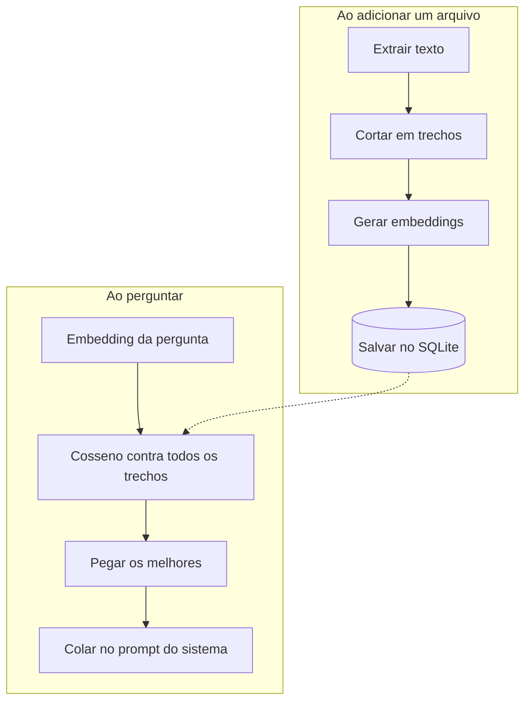

# RAG

RAG é dar contexto ao modelo antes dele responder. Em vez de esperar que ele "saiba" o que está no
meu PDF, eu procuro os pedaços relevantes e colo no prompt. O modelo continua sendo o mesmo, o que
muda é o que ele tem na frente.

Aqui isso são quatro etapas, cada uma num arquivo de `src-tauri/src/rag/`.



## 1. Extrair o texto (`ingest.rs`)

`.txt`, `.md`, `.csv` e `.json` são lidos direto, com `from_utf8_lossy` para não quebrar em arquivo
com codificação estranha. `.pdf` passa pela crate `pdf-extract`.

PDF é o caso problemático. A crate entra em pânico com alguns arquivos, então a chamada fica dentro
de `catch_unwind` — sem isso um PDF ruim derruba o app inteiro. E se o PDF é escaneado, o texto
extraído vem vazio: o app avisa que não tem texto extraível em vez de indexar nada.

## 2. Cortar em trechos (`chunk.rs`)

2000 caracteres por trecho, com 200 de sobreposição. Os dois valores estão em Configurações →
Busca nos documentos, e valem para o que for indexado dali em diante — mudar não reprocessa o que
já está no banco.

Contando caractere, não token. Token seria mais correto — é o que o modelo enxerga — mas exigiria um
tokenizador por família de modelo. Para o meu uso a diferença não aparece, e o custo é uma
dependência a menos.

A sobreposição existe porque o corte cai no meio de uma ideia mais vezes do que se imagina. Repetir
200 caracteres entre trechos vizinhos faz uma frase cortada aparecer inteira em pelo menos um dos
dois.

O corte não é cego no caractere 2000. A função procura, nos últimos 30% da janela, um lugar melhor
para cortar, nesta ordem: quebra de linha, fim de frase (`.`, `!`, `?`), espaço. Só se não achar
nada é que corta no meio da palavra.

O texto é percorrido como `Vec<char>`, não como bytes. Cortar `String` por índice de byte em texto
com acento gera pânico ou caractere quebrado, e o app é em português — tem acento em toda frase.
Tem teste para isso.

## 3. Gerar embeddings (`embed.rs`)

Embedding é o texto virando uma lista de números, onde textos parecidos ficam perto. Três provedores
funcionam:

| Provedor | Modelo padrão | Endpoint |
| --- | --- | --- |
| Ollama | `nomic-embed-text` | `POST /api/embed`, com `/api/embeddings` como plano B |
| OpenAI | `text-embedding-3-small` | `POST /embeddings` |
| Gemini | `gemini-embedding-001` | `POST /models/{modelo}:batchEmbedContents` |

Ollama é o padrão porque é grátis e roda offline. O `/api/embed` é o endpoint novo e aceita lote;
versões antigas só têm `/api/embeddings`, que é um texto por vez — se a primeira der 404, o código
cai para a segunda sozinho.

Os trechos vão em lotes de 16. Um documento de 100 páginas dá umas 250 chamadas se fosse um a um;
em lote são 16. Durante a indexação o Rust manda eventos `ingest-progress` e a tela mostra
"indexando 32/210 trechos".

## 4. Buscar (`search.rs`)

Similaridade por cosseno: o ângulo entre o vetor da pergunta e o de cada trecho. Vale de -1 a 1,
onde 1 é a mesma direção.

```rust
dot / (norm_a.sqrt() * norm_b.sqrt())
```

A busca é linear: carrega todos os trechos daquele modelo e compara com todos. Nada de índice, nada
de HNSW. Com 5 mil trechos de 768 dimensões isso é uns poucos milissegundos, muito menos do que a
chamada de embedding que acabou de acontecer. Se um dia passar de umas dezenas de milhares, aí sim
vale um índice — e é o único lugar que precisaria mudar.

Ficam os 4 melhores e trechos com nota abaixo de 0.15 são descartados. Sem esse piso, uma pergunta
sem relação nenhuma com a base ainda traria os quatro trechos "menos ruins" e o modelo tentaria
responder com eles.

Os dois números estão em Configurações. Subir o piso deixa a busca exigente e faz o modelo admitir
mais vezes que não achou; baixar traz mais contexto e mais ruído junto.

## 5. Montar o prompt (`mod.rs`)

Os trechos escolhidos viram um bloco anexado à instrução do sistema:

```
Use os trechos abaixo para responder. Cite o documento quando usar um trecho.
Se a resposta não estiver neles, diga que não encontrou nos documentos.

[1] manual.pdf
...texto do trecho...

[2] notas.md
...texto do trecho...
```

A instrução de admitir que não sabe importa. Sem ela o modelo preenche a lacuna com o que ele já
sabia, e aí o RAG não serve para nada — eu não consigo mais distinguir o que veio do documento do
que veio do treinamento.

Os nomes dos documentos são gravados junto com a mensagem, e aparecem como etiquetas embaixo da
resposta.

## Detalhes que custaram tempo

**Cada trecho guarda qual modelo o gerou**, no formato `ollama:nomic-embed-text`. Vetores de
modelos diferentes têm dimensões diferentes e não podem ser comparados. A busca filtra por essa
etiqueta, então trocar o modelo de embedding esconde o que foi indexado antes até reindexar. É
melhor sumir do que comparar coisa incomparável e devolver resultado sem sentido.

**A base é global.** Todas as conversas enxergam todos os documentos. Base por conversa seria mais
flexível, mas para estudar não fazia diferença e dobrava a complexidade da tela.

**O botão "Usar documentos" fica desligado por padrão.** Buscar sempre custa uma chamada de
embedding em toda pergunta, e a maior parte das minhas perguntas não tem nada a ver com os arquivos
que indexei.

## O que eu faria diferente com mais tempo

- Busca híbrida, misturando cosseno com BM25. Vetor é ruim com nome próprio, código e número.
- Reranking dos 20 melhores com um modelo pequeno antes de escolher os 4.
- Reindexar automático quando o modelo de embedding muda, em vez de só esconder.
- Guardar de qual página do PDF veio o trecho, para citar direito.
